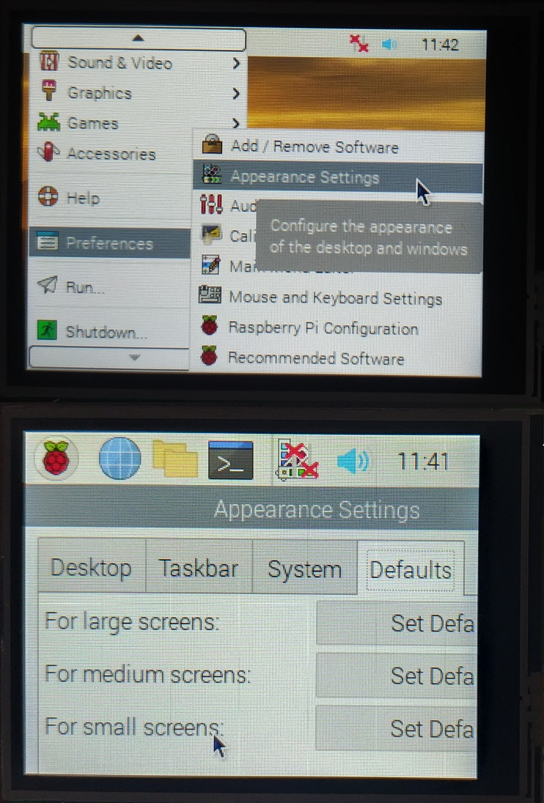

# 使用说明

1. 将屏幕模组插到树莓派上, 并用铜柱和螺丝固定  
2. 上电，在(ssh)终端运行
```
$ git clone https://github.com/fan12398/rasp_panel28.git
$ cd rasp_panel28
$ chmod +x install.sh
$ ./install.sh
```
其中`install.sh`后可加参数显示角度，从`0/90/180/270`四选一，不加参数默认为旋转270度显示。示例  
```
$ ./install.sh 180
```
如果不需要安装触屏驱动，加上参数`only_disp`即可，示例  
```
$ ./install.sh 90 only_disp
```  
3. 安装完成之后，树莓派会自动重启  
4. 在终端执行`startx`进入桌面之后，如果发现触摸不准，请给树莓派插上键盘，按`Ctrl+Alt+T`快捷键打开终端(注意校准操作不能在远程终端进行)，然后运行
```
$ cd rasp_panel28
$ ./recalibrate.sh
```
用触屏笔点击四个校准点，即可完成校准操作。

# 桌面小屏适配
初次进入桌面后，发现图标和文字都很大。可以在桌面点击左上角的`菜单`图标，在下拉框中依次选择`Preferences`->`Apperance Settings`。然后在窗体中选择最后一个`Defaults`选项卡，点击最下面一个`For small screens`后面的按钮，关闭该窗体即完成小屏适配。  


# 管脚说明
  
2.8寸IPS屏模块使用管脚的 BCM 编码:  
SPI_CLK  -> 11  
SPI_MOSI -> 10  
SPI_MISO -> 9  
LCD_CS   -> 8 (spi0.0 CE0)  
LCD_DC   -> 22  
LCD_RST  -> 27  
LCD_BL   -> 17  
TOUCH_CS -> 7 (spi0.1 CE1)  
TOUCH_IRQ-> 4  

3.3V 和 GND 选择对应的管脚连接即可。  
